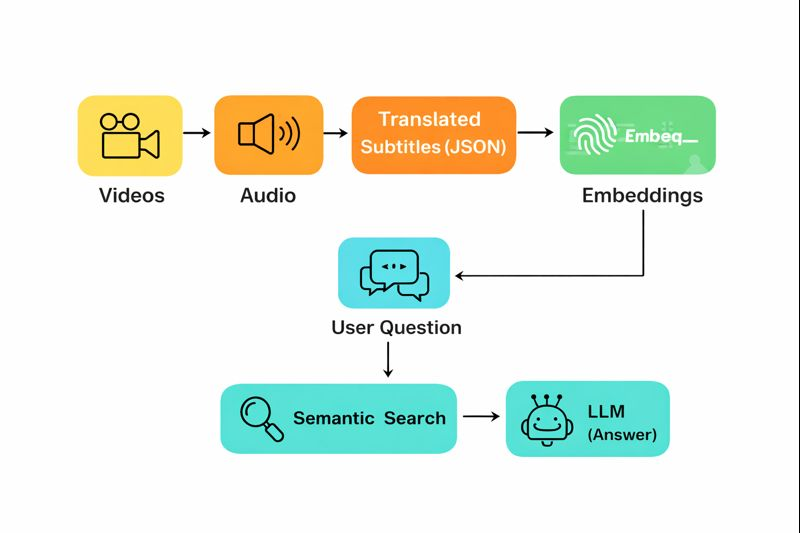

## 📚 RAG-based DSA Video QA System

->This project implements a Retrieval-Augmented Generation (RAG) pipeline that answers questions about a Data Structures & Algorithms video playlist by returning relevant video numbers and timestamps.

->It processes lecture videos, generates embeddings from subtitles, retrieves the most relevant segments, and uses an LLM to produce grounded, teacher-like answers.

## ▶️ How to Run

1.Extracts audio from the DSA lecture videos using ffmpeg.
 python process_videos.py

2.Transcribes and translates audio files into timestamped subtitle chunks.
 python create_chunks.py

3.Generates vector embeddings for each subtitle chunk and stores them for retrieval.
 python create_embeddings.py

4.Accepts a user question, retrieves relevant video chunks, and generates a grounded answer with video timestamps.
 python process_inputs.py

